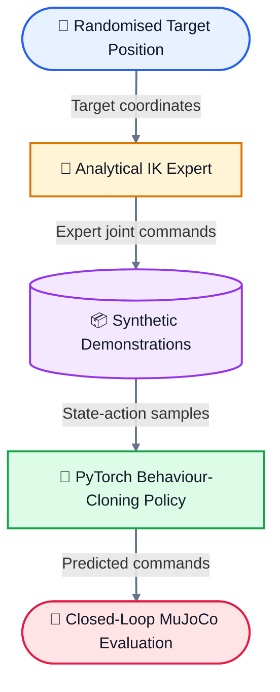

# NeuroGrasp: Synthetic-Data Behaviour Cloning for Robot Reaching

# NeuroGrasp-VLA: Behaviour-Cloning Prototype for Robot Reaching

**NeuroGrasp-VLA** is an end-to-end imitation-learning prototype for
state-conditioned robot reaching in MuJoCo.

The project generates synthetic expert demonstrations using analytical inverse
kinematics, trains a PyTorch behaviour-cloning policy, and evaluates the learned
controller across randomised target positions.

The current policy receives robot joint positions and target-block coordinates
and predicts three continuous joint-position commands.

> **Current scope:** Language instructions are stored in the generated dataset
> as metadata but are not currently used as model inputs. The simulated robot
> has no gripper, so the demonstrated behaviour is reaching and contact rather
> than grasping or lifting.


Behaviour-cloning policy reaching toward and contacting a red target block in MuJoCo.

## 🧠 System Architecture



### 1. Synthetic Expert-Data Generator

`generate_expert_data.py` generates synthetic demonstrations using an
analytical inverse-kinematics controller.

- **Episodes:** 500
- **Steps per episode:** 100
- **Total samples:** 50,000
- **Target variation:** Y position from `-0.20 m` to `0.20 m`
- **Recorded data:** Robot state, target position, expert action, and text metadata

### 2. Behaviour-Cloning Policy

`train_bc_policy.py` trains a PyTorch multilayer perceptron to predict
continuous joint-position commands.

```text
Robot joint positions + target coordinates
                       ↓
           Joint-position commands
```

#### Model Configuration

| Component | Configuration |
|---|---:|
| Policy input | 6 values |
| Hidden layers | 128, 128 |
| Activation | ReLU |
| Policy output | 3 commands |
| Loss function | Mean squared error |
| Optimiser | Adam |
| Learning rate | 0.001 |
| Batch size | 32 |
| Training epochs | 50 |

> The current policy uses numerical robot states and target coordinates.
> Language strings are stored as dataset metadata but are not currently passed
> to the neural network.

### 3. Closed-Loop MuJoCo Evaluation

`evaluate_vla_policy.py` evaluates the trained policy across five simulation
episodes with randomised target Y positions.

During each simulation step:

1. The policy receives the current joint positions and block coordinates.
2. The policy predicts three joint-position commands.
3. MuJoCo applies the predicted commands through position actuators.
4. The simulation advances and generates the next observation.

The current evaluation visually demonstrates reaching and physical contact with
the red block. Quantitative reach-error and contact-success metrics have not yet
been implemented.

---

## 🚀 Quickstart Guide

### 1. Generate the Expert Dataset

```bash
python generate_expert_data.py
```

This creates:

```text
dataset/vla_expert_data.npz
```

### 2. Train the Behaviour-Cloning Policy

```bash
python train_bc_policy.py
```

The trained policy is saved to:

```text
models/bc_policy.pth
```

### 3. Run Closed-Loop Evaluation

```bash
mjpython evaluate_vla_policy.py
```

The evaluation runs five episodes with randomised target Y positions.

---

## 🛠️ Technical Stack

- **Physics simulation:** MuJoCo
- **Machine learning:** PyTorch
- **Learning method:** Supervised behaviour cloning
- **Expert controller:** Analytical inverse kinematics
- **Data processing:** NumPy
- **Policy architecture:** Multilayer perceptron
- **Control interface:** MuJoCo position actuators

